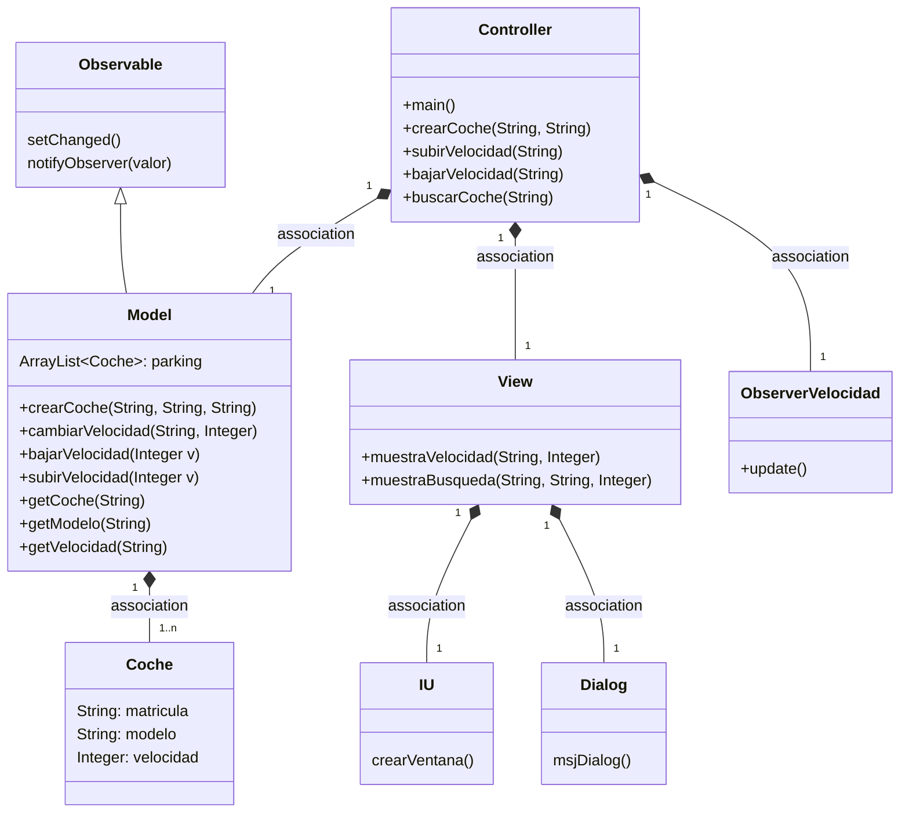
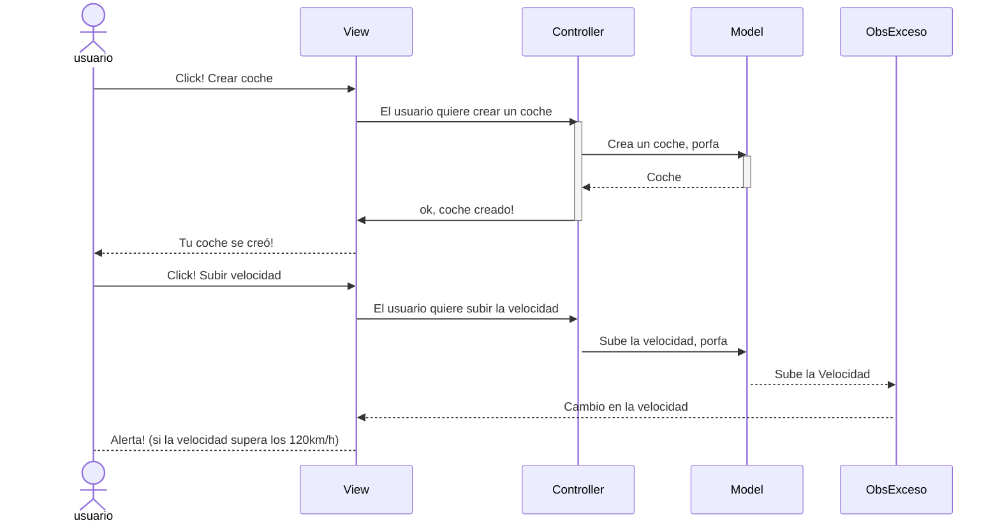

## Diagrama de clases:

---

## Pasos para crear el observer

1. Model
    * Extiende de `Observable`
    * En el método en donde ocurra el cambio (en nuestro caso cambiarVelocidad, subirVelocidad y bajarVelocidad):
        * setChanged()
        * notifyObserver(Valor) -> en este caso: notifyObserver(getCoche(matricula))
        
2. Crear una clase que sea el observador, que implementa la interface `Observer` (ObserverVelocidadMax)
    * definir el método `update()`
    * definir las condiciones en las que avisará
    
3. Controller
    * Instanciar el observer
    * Añadir este observer al observable con `addObserver()`

---

## Evento en la Vista con el Observer
Este sería el diagrama de secuencias explicado de forma general

---
