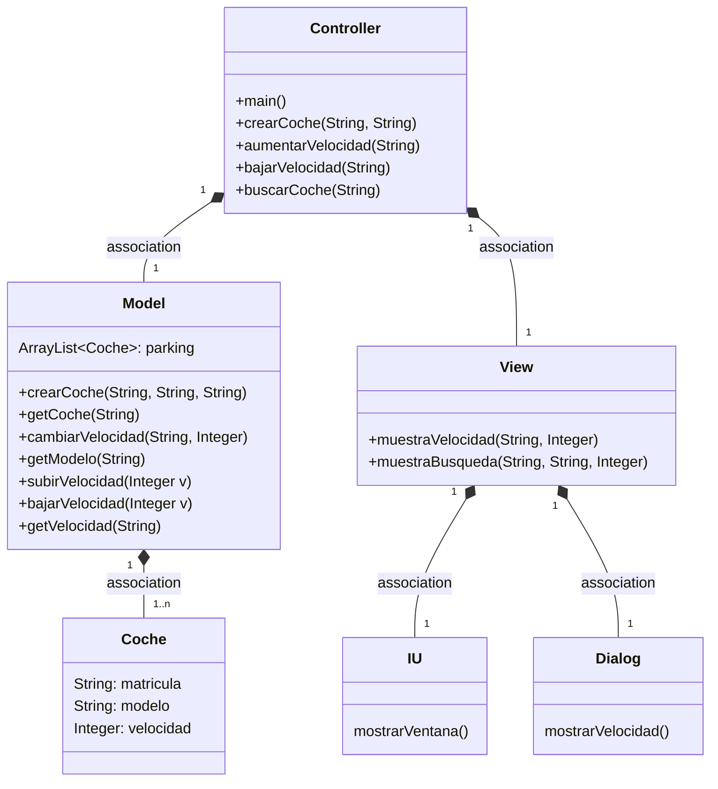
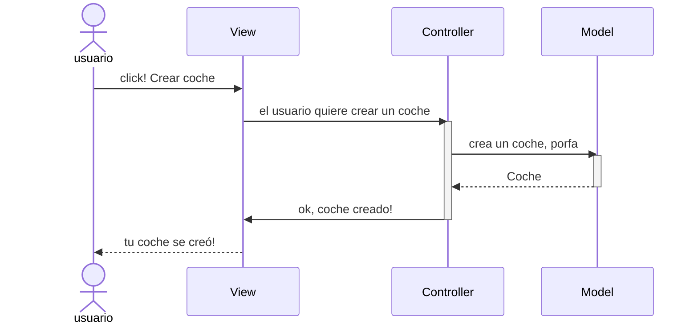
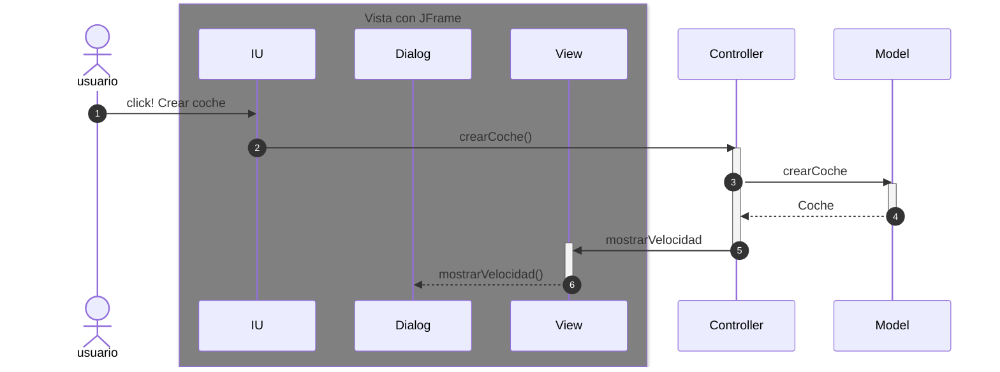

# Arquitectura MVC

Aplicación que trabaja con objetos coches, modifica la velocidad y la muestra

---
## Diagrama de clases:

---

## Evento en el View

Cuando ocurre un evento en la vista, el `controller` se tiene que enterar.
Tenemos que tener en cuenta que en el MVC estricto, la vista no se comunica con el modelo.

En el listener del botón llamamos al `controller`

Ahora la parte de la Arquitectura de la vista, son tres clases

## EXPLICACION EX3

En el Controller cree la clase 'buscarCoche', en la Model 'getModelo' y en la View 'muestraBusqueda'. Además cree un botón 'Buscar' para usar esta funcionalidad en el interfaz gráfica.
